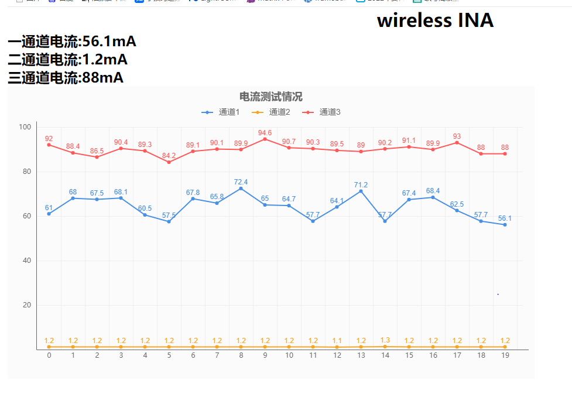

# esp_web_ina
使用ESP01s和INA3221的网络电流表，该版本使用Micropython 1.20为基础。

#### 介绍
ESP8266下的电流表,使用ESP01s,OLED(SSD1306),INA3221模块，
默认使用离线版本的无线电流机，即只在OLED上显示即时电流及平均电流。

可以在开机时按下按钮1秒（D2接GND），使用网络电流机。
首先配网情况下，访问OLED上的网站IP加端口，访问网页。
可以在线查看电流情况，也可以下载相关的电流数据（EXCEL表格）

WEB界面 400mS 一次访问 

### 固件烧录
请先将ESP01s(ESP8266)烧录micropython 1.20固件
https://micropython.org/resources/firmware/esp8266-1m-20230426-v1.20.0.bin

### 连接
|ESP01S(ESP8266)|OLED|INA3221|-|
|-|-|-|-|
|3v3|3v3|3v3||
|GND|3v3|3v3|开关|
|0 (D3)|scl|scl||
|2 (D4)|sda|sda|开关|

### 上传文件

请依次上传以下文件
* main.py (WEB 配网判断没有弄)
* just_oled.py 
* layout.html
* content.html
* wifi.html
* sChart.js
* ssd1301.py
* ina3221.py

默认INA3221地址为0x40
`ina=ina3221.INA3221(i2c,addr=0x40) #A0与GND`

### PCB
第一次搞PCB，及其不美观~~
可以参考打板
https://oshwhub.com/circuitpython/ina8266
